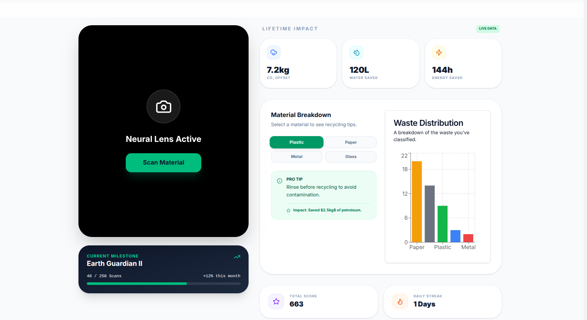
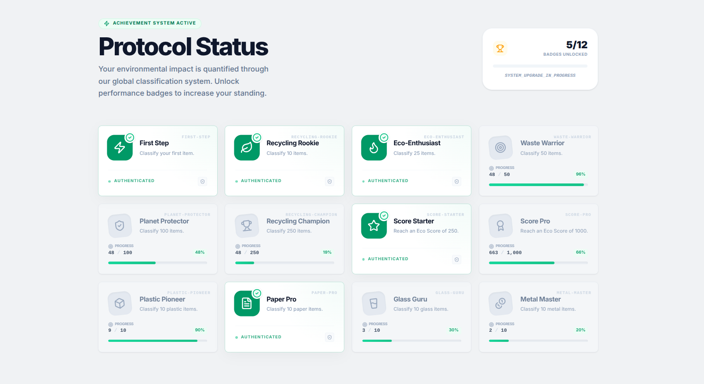
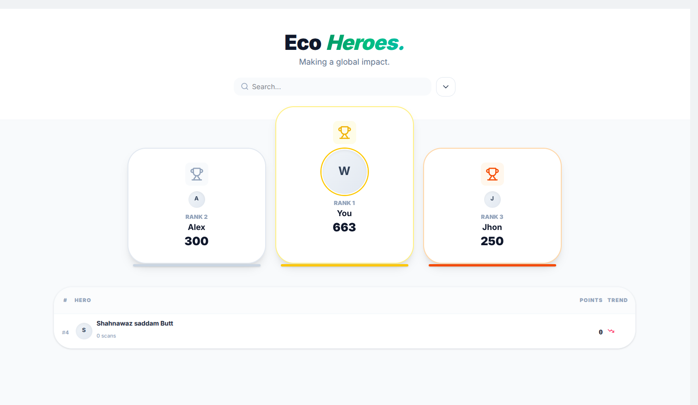
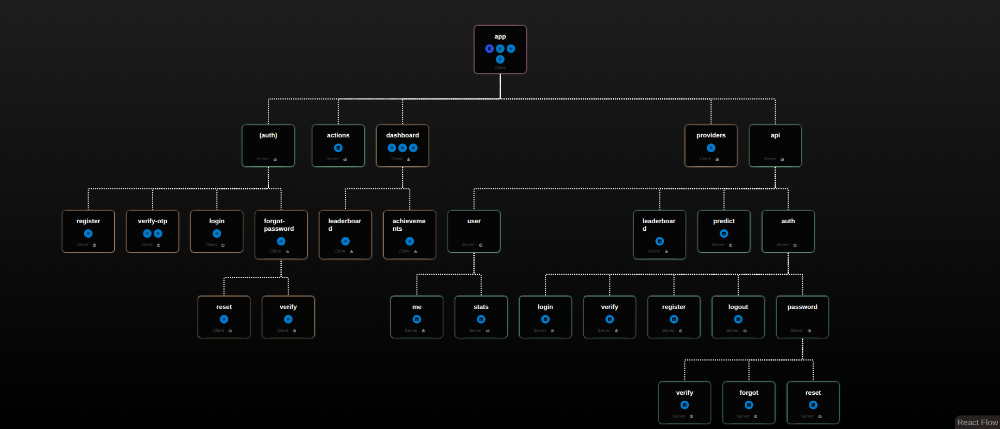

# entity["organization","EcoLens","ai waste app"] — AI‑Powered Waste Classification & Gamified Environmental Impact

**Website:** https://eco.wahb.space  
**Repository:** `github.com/wahb-amir/ecolens`  
**Status:** Production-ready (documentation)  

---

## 🚀 TL;DR
EcoLens turns everyday waste photos into measurable environmental impact. Users scan or upload waste, an AI classifies the material, and EcoLens calculates **CO₂ offset**, **water saved**, and **energy saved**. Gamified achievements, material-specific tips, and a global leaderboard drive sustained behavior change.

## 📸 Demo / Screenshots

| Dashboard | Achievements | Leaderboard |
| :--- | :--- | :--- |
|  |  |  |

*System Flow Diagram:* 
## ✨ Key Features

- **AI Classification (Camera & Upload)** — Detects plastic, metal, paper, glass, organic, and more; returns label + confidence.
- **Impact Estimation** — Converts classifications into estimated weight → CO₂ offset, water & energy savings, and eco points.
- **Gamification** — Achievements, streaks, and a global leaderboard to boost retention.
- **User Dashboard** — Lifetime impact, daily streaks, category breakdowns, and progress visualizations.
- **Real-time Feedback** — Immediate toast notifications and in-app unlocks on new achievements.
- **Privacy-first Auth** — HTTP-only cookies for tokens; minimal PII exposure.

---

## ⚙️ How It Works (End‑to‑end)
1. **Scan / Upload:** User captures an image via mobile or desktop.
2. **Predict:** Frontend sends `POST /api/predict` (with `access_token` cookie) to backend.
3. **Inference:** Backend proxies image to the hosted ML service, receiving labels + confidences.
4. **Calculate:** Label → estimated weight → environmental impact (CO₂, water, energy) → points.
5. **Persist:** Creates `Scan` record, updates `User` stats, runs achievement engine, recalculates leaderboard rank.
6. **Notify:** UI updates in real time (websocket or polling) and displays results & badges.

---

## 🏗️ Architecture & Stack
- **Frontend:** Next.js, React, Tailwind CSS
- **Backend:** Node.js, Next.js API routes (TypeScript), Express-style handlers where applicable
- **ML Service:** Python (PyTorch / TensorFlow) or hosted Hugging Face Spaces endpoint
- **Database:** MongoDB (primary); Redis (caching, leaderboard, rate-limits)
- **Auth:** JWTs delivered via secure, `httpOnly` cookies (`access_token`, `refresh_token`)
- **Deployment:** Hostinger VPS with NGINX, PM2, Let’s Encrypt SSL

---

# API Reference — Single File
**Base URL:** `https://eco.wahb.space/api`

> All endpoints use JSON. Auth is via `httpOnly` cookies unless otherwise noted.

### Common Auth Notes
- Recommended cookie names: `access_token` (short-lived ~15m), `refresh_token` (long-lived ~7d), `verification_token` (OTP flow).
- Tokens are set with `httpOnly` and `secure` flags in production. Use `sameSite: 'strict'`.
- OTP TTL: 1 hour. Max OTP attempts: 10.

---

## `POST /api/auth/register`
Create a new user and start email verification (sends OTP).

**Request**
```json
{ "name": "Wahb Amir", "email": "wahb@example.com", "password": "supersecurepassword" }
```

**Responses**
- `201 Created` — account created, verification OTP sent. Cookie set: `verificationToken` (httpOnly, 1h).
  ```json
  { "msg": "Account created. Verification code sent to wahb@example.com" }
  ```
- `400` — validation error
- `409` — email already exists
- `500` — server / email provider failure

**Notes**: Creation runs inside a MongoDB transaction (user + OTP). If email fails post‑commit, the system attempts cleanup.

---

## `POST /api/auth/login`
Authenticate existing user. Handles verified and unverified flows.

**Request**
```json
{ "email": "wahb@example.com", "password": "supersecurepassword" }
```

**Behavior**
- Invalid credentials → `401 Invalid email or password` (generic to prevent enumeration).
- If unverified: triggers OTP flow (returns `200` with `pending_verification` or `otp_sent`).
- If verified: issues `access_token` & `refresh_token` cookies.

**Success**
```json
{ "success": true, "message": "Login successful" }
```

**Cookie policy (prod)**
- `access_token`: `httpOnly`, `secure`, `sameSite: 'strict'`, expires ≈ 15 minutes
- `refresh_token`: `httpOnly`, `secure`, `sameSite: 'strict'`, expires ≈ 7 days

---

## `POST /api/auth/verify`
Verify email OTP. Uses `verificationToken` cookie if present, or `email` + `otp` in body.

**Request**
```json
{ "otp": "123456" }
```

**Success (200)**
- Marks user `isVerified = true`, deletes OTP record(s), issues auth cookies, clears `verificationToken`.
```json
{ "message": "Account verified and logged in", "user": { "id": "...", "email": "...", "role": "user" } }
```

**Errors**
- `400` invalid body
- `401` incorrect OTP
- `410` OTP expired
- `429` too many attempts
- `404` user not found
- `500` server error

**Implementation note**: standardize cookie names to `access_token` / `refresh_token` (some code paths use `accessToken`).

---

## `GET /api/auth/logout`
Terminate session. Clears relevant cookies and sets `Clear-Site-Data` headers.

**Response (200)**
```json
{ "success": true, "message": "Session terminated successfully", "timestamp": "2026-02-24T12:34:56.789Z" }
```

---

## `POST /api/auth/password/forgot`
Request password reset OTP.

**Request**
```json
{ "email": "wahb@example.com" }
```

**Responses**
- `200` OTP sent (or generic 200 to avoid enumeration)
- `500` email send error

---

## `POST /api/auth/password/reset`
Submit OTP + new password.

**Request**
```json
{ "email":"wahb@example.com", "otp":"123456", "newPassword":"newStrongPassword" }
```

**Responses**
- `200` password reset successful
- `400/401/410/429` OTP related errors
- `500` server error

---

## `GET /api/leaderboard`
Get top users (verified-only) and optionally current user's rank.

**Query**
- `userId` (optional) — compute rank for this user if not in top N

**Response (200)**
```json
{ "success": true, "data": [ /* top list */ ], "currentUser": { /* optional */ } }
```

**Notes**
- Only verified users appear on global leaderboard. If a supplied `userId` is outside top results, service returns computed rank.

---

## `POST /api/predict`
Run AI prediction for an image. **Auth required** (`access_token`).

**Request**
```json
{ "dataUrl": "data:image/jpeg;base64,..." }
```

**Valid match (Success)**
- Backend proxies to inference service, maps label → category, computes `pointsEarned = round(confidence * 20)`, updates user & achievements, creates a `Scan`.

```json
{
  "predictions": [{ "label": "Plastic Bottle", "prob": 0.92 }],
  "scanId": "624f...",
  "pointsEarned": 18,
  "newAchievements": ["waste_warrior"],
  "userStats": { "streak": 3, "totalScans": 51, "ecoScore": 680, "achievementsCount": 5 },
  "inference_time": 1.234
}
```

**No confident match**
```json
{ "predictions": [{ "label": "unknown", "prob": 0.20 }], "noMatch": true, "message": "No confident match" }
```

**Errors**
- `401` missing/invalid token
- `400` missing `dataUrl`
- `422` model failed to identify
- `500` internal

---

## `GET /api/user`  (aka `/api/user/me`)
Check auth & optionally rotate tokens with `refresh_token`.

**Response (200)**
```json
{ "id": "userId" } // or null if unauthenticated
```

---

## `GET /api/user/stats`
Return authenticated user's dashboard stats.

**Response**
```json
{
  "totalScans": 48,
  "ecoScore": 663,
  "streak": 1,
  "categoryStats": { "plastic":9, "paper":12, "glass":3, "metal":2, "organic":0, "other":0 },
  "unlockedAchievements": ["first_step","recycling_rookie"]
}
```

**Errors**: `401` / `404` / `500`

---

## DB Schemas (summary)

**users**
```json
{
  "name": "String",
  "email": "String",
  "password": "String",
  "isVerified": "Boolean",
  "ecoScore": "Number",
  "totalScans": "Number",
  "streak": "Number",
  "lastScanDate": "Date",
  "categoryStats": { "plastic":0, "paper":0, "glass":0, "metal":0, "organic":0, "other":0 },
  "achievements": [{ "achievementId":"String", "unlockedAt":"Date" }],
  "tokens": [{ "token":"String", "createdAt":"Date" }],
  "createdAt": "Date",
  "updatedAt": "Date"
}
```

**scans**
```json
{
  "userId": "ObjectId",
  "label": "String",
  "confidence": "Number",
  "imageUrl": "String (optional)",
  "pointsEarned": "Number",
  "metadata": "Mixed",
  "createdAt": "Date"
}
```

**otp**
```json
{
  "userId": "ObjectId",
  "type": "email_verification | password_reset",
  "codeHash": "String",
  "expiresAt": "Date",
  "attempts": "Number"
}
```

Indexes: `{ userId, type }` unique; `expiresAt` TTL index.

---

## cURL Examples

**Login (verified user)**
```bash
curl -X POST https://eco.wahb.space/api/auth/login \
  -H "Content-Type: application/json" \
  -d '{"email":"user@example.com","password":"supersecurepassword"}' \
  -c cookies.txt -i
```

**Predict**
```bash
curl -X POST https://eco.wahb.space/api/predict \
  -H "Content-Type: application/json" \
  -b cookies.txt \
  -d '{"dataUrl":"data:image/jpeg;base64,..."}'
```

**Get leaderboard**
```bash
curl https://eco.wahb.space/api/leaderboard
```

---

## ✅ Best practices & Production checklist
- Enforce HTTPS and `secure` cookie flag in all environments except local dev.
- Rate limit `POST /api/predict` and auth endpoints to prevent abuse (e.g. 10–30 r/m per IP for predict depending on infra).
- Monitor ML latency & fallback gracefully (return `422` with `noMatch` if model unavailable).
- Log critical events (OTP sends, login failures, token rotations) with a centralized logger.
- Add automated tests for auth flows, OTP edge cases, and leaderboard ranking logic.

---

## 🛠️ Local Setup
1. Clone repo:
```bash
git clone https://github.com/wahb-amir/ecolens.git
cd ecolens
```
2. Install:
```bash
pnpm install  # or npm install
```
3. Environment:
```bash
cp .env.example .env
# populate MONGO_URI, JWT secrets, SMTP creds, HF_SPACE_URL (if any)
```
4. Run